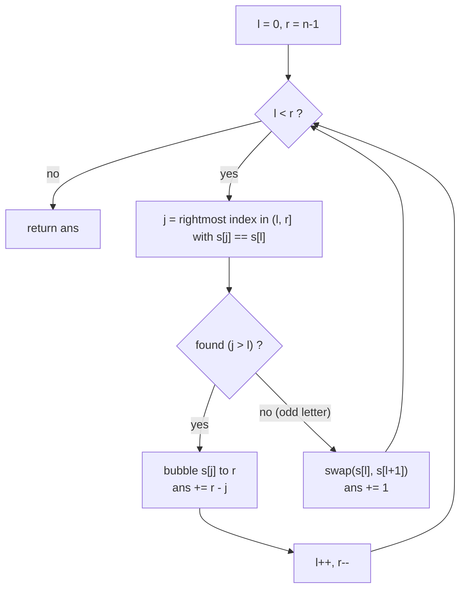

# Minimum Moves to Make Palindrome — The Complete Thought Process

> Goal of this document: not just *what* the solution is, but *how you would invent it
> yourself* in an interview, starting from zero knowledge of the trick.

---

## 0. Reading the problem like an algorithmist

Three phrases in the statement are doing all the work:

1. **"swap any two adjacent characters"** — the move set is adjacent transpositions.
2. **"minimum number of moves"** — we want a shortest path in some state space.
3. **"guaranteed to be convertible into a palindrome"** — the multiset of letters
   admits at least one palindrome arrangement (at most one letter has odd count).

Constraint scan: `n ≤ 2000`. That is the classic signature of an **O(n²)** intended
solution. Whatever we invent, quadratic is enough. Keep that in the back pocket — it
tells us we do *not* need segment trees or clever data structures.

---

## 1. First principle: adjacent swaps = inversions

Before touching palindromes, answer a simpler question:

> If I fix a **target** arrangement `T` of the same letters, what is the minimum
> number of adjacent swaps to turn `s` into `T`?

This is a classic fact worth deriving once in your life:

- Label each character of `s` with the position it must occupy in `T`
  (matching equal letters **in order**: k-th `'a'` of `s` → k-th `'a'` of `T`).
  This gives a permutation `p`.
- One adjacent swap changes the number of **inversions** of `p` by exactly ±1
  (it touches one neighbouring pair, flipping its order).
- The target has 0 inversions. So you need **at least** `inv(p)` swaps, and
  bubble-sort style you can always achieve exactly `inv(p)`.

```
minimum adjacent swaps (s → T)  =  inv(p)     — inversions of the induced permutation
```

Why match equal letters *in order*? Because making two identical letters cross
each other changes nothing visibly but costs a swap:

```
... a₁ ... a₂ ...      swapping a₁ past a₂ produces the SAME string
                        but burned ≥ 1 move  →  never do it
```

**Lemma (never-cross).** In some optimal solution, identical letters preserve
their relative order. This little lemma is the load-bearing wall of the whole
proof later. Remember it.

So the problem is now:

> Over **all palindrome arrangements** `T` of the letters of `s`,
> minimize `inv(s → T)`.

---

## 2. BFS over the solution space (what could we even try?)

Survey before you dig. Candidate approaches, cheapest thinking first:

| # | Approach | Complexity | Verdict |
|---|----------|-----------|---------|
| 1 | BFS over strings, edges = adjacent swaps | states ≈ n!/(dups) | ❌ Only for n ≤ 10. (We *will* use it — as the brute-force verifier in `test.cpp`.) |
| 2 | Enumerate every palindrome target `T`, count inversions, take min | #targets is exponential (choose which twin of each pair goes left) | ❌ 2^(n/2) targets. Dead. |
| 3 | DP over "which characters already placed on each side" | state = multiset of remaining letters → huge | ❌ No compact state. |
| 4 | **Greedy two pointers**: fix outer pair first, pair `s[l]` with its rightmost twin | **O(n²)** | ✅ Fits n ≤ 2000 exactly. Needs a proof. |
| 5 | Same greedy, but count moves with a BIT instead of physically swapping | O(n log n) | ✅ Follow-up flex; unnecessary here. |

The instructive part is *why* 2 and 3 die: the freedom is in **pairing** — every
letter with count ≥ 2 must be split into (left copy, mirrored right copy), and the
number of ways to do that explodes. Any winning idea must kill that freedom with
a structural argument, not enumeration. That is what the greedy does.

---

## 3. Inventing the greedy: two insights

### Insight A — peel the onion (why outermost first?)

A palindrome is a set of concentric shells:

```
position:   0   1   2   3   4   5
            └───┼───┼───┼───┼───┘      shell 0 :  (0, 5)
                └───┼───┼───┘          shell 1 :  (1, 4)
                    └───┘              shell 2 :  (2, 3)
```

Suppose we somehow decide, cheaply and safely, which two equal letters occupy
shell 0 and pay to move them there. Then positions `0` and `n-1` never need to
be touched again, and what remains — `s[1..n-2]` — is **the same problem, two
sizes smaller**. Self-similar structure ⇒ solve the outer shell, recurse inward.
The whole algorithm will be a `while (l < r)` loop.

The outer positions are also the most *constrained*: exactly two equal letters
must land there, and every swap that drags a letter outward crosses the most
territory. Deciding them first means every later decision happens in a strictly
smaller window — decisions never invalidate each other.

### Insight B — pair `s[l]` with its RIGHTMOST twin

Fix the left end: whatever letter sits at `s[l]`, some copy of it must end at
position `r` (they mirror each other). Which copy? Look at the choice:

```
s :   a   x   a   y   a          (window l=0 .. r=4, letter 'a' at 0, 2, 4)
      ↑       ↑       ↑
      l      j'=2    j=4  ← rightmost twin

Option RIGHTMOST (j=4):   already at r → cost 0
Option MIDDLE   (j'=2):   drag it right past 'y' and past a₃ → cost 2,
                          and one of those swaps crossed an identical 'a' —
                          by the never-cross lemma, a provably wasted move.
```

General exchange argument. Take any optimal target `T`. By the never-cross
lemma we may assume equal letters keep relative order. Then the letter of `s[l]`
that lands at position `r` in `T` must be the **last** of its kind inside the
window — i.e. exactly the rightmost twin `j`. Any pairing that sends an earlier
copy `j' < j` to the right end forces `j'` to cross `j` — a crossing of equal
letters, which optimality forbids. So the greedy choice isn't merely "not worse";
it is the only choice consistent with an optimal solution.

Cost accounting: bubbling `s[j]` to position `r` costs exactly `r − j` swaps,
and each of those swaps moves a *distinct* letter one step left — a step those
letters can reuse, never a step against them. Nothing is double-paid.

```
before:   [ a  x  y  a ]        j = 3 already = r → cost 0   (best case)
before:   [ a  x  a  y ]        j = 2, r = 3 → bubble once:
              swap (2,3)  →  [ a  x  y  a ]      cost 1
```

### Putting A + B together

```
l = 0, r = n-1
while l < r:
    j = rightmost index in (l, r] with s[j] == s[l]
    if such j exists:
        bubble s[j] to position r      (cost r - j, do the swaps for real)
        l++, r--                       (shell done, peel inward)
    else:
        ???                            ← the odd character. Next section.
```

---

## 4. The odd-count character (the `j == l` case)

If no twin of `s[l]` exists in `(l, r]`, then `s[l]` is the letter with **odd
count** — its destiny is the exact center of the palindrome. Two temptations,
one right answer:

- **Wrong instinct:** "move it straight to the center now, pay `mid − l`."
  Risky — you'd be paying for a journey through territory whose final layout you
  haven't decided yet; you can overpay.
- **Right move:** swap it **one step inward** (`swap(s[l], s[l+1])`, cost 1) and
  simply **re-examine position `l`** without shrinking the window.

Why this is safe, from first principles: the odd letter must end strictly inside
every shell, so it must eventually move inward past position `l` — that unit of
work is **unavoidable**, costing exactly 1 no matter what. Deferring it one step
at a time interleaves its journey with the pair decisions, and each unit is paid
exactly once. (The brute-force cross-check in `test.cpp` also confirms this
empirically on thousands of random strings.)

```
Diagram — odd letter 'c' drifting to the center as shells resolve:

  c b a a b        s[0]='c' has no twin → swap inward (cost 1)
  ↑
  b c a a b        s[0]='b' twin at 4, already at r (cost 0) → peel
  ^       ^
  b [c a a] b      s[1]='c' no twin in window → swap inward (cost 1)
  b [a c a] b      s[1]='a' twin at 3, already in place → peel
  b a [c] a b      window collapsed to the center. Done. Total = 2.
```

---

## 5. Full worked example — `s = "letelt"` (answer: 2)

```
index:    0   1   2   3   4   5
          l   e   t   e   l   t
          ↑                   ↑
          l=0                 r=5

Step 1: s[l]='l'. Rightmost 'l' in (0,5] is j=4.
        Bubble j=4 → 5:  swap(4,5)                          cost 1

          l   e   t   e   t   l
          ✓                   ✓        shell 0 done → l=1, r=4

Step 2: s[l]='e'. Rightmost 'e' in (1,4] is j=3.
        Bubble j=3 → 4:  swap(3,4)                          cost 1

          l   e   t   t   e   l
              ✓           ✓            shell 1 done → l=2, r=3

Step 3: s[l]='t', rightmost 't' is j=3 = r. Already placed.  cost 0
          l   e   t   t   e   l        l=3 ≥ r=2 → STOP
                  ✓   ✓

TOTAL = 2      final string "lettel" ... check: l-e-t-t-e-l ✓ palindrome
```

Notice what the greedy *didn't* do: it never asked "should the final palindrome
be `lettel` or `teltet` or ...?" — the target emerged as a by-product of locally
optimal shell decisions. That is the whole trick: **the pairing freedom that
killed approaches 2 and 3 is resolved one shell at a time, for free.**

Decision flow (renders in Obsidian):



---

## 6. The algorithm, final form

```
minMoves(s):
    ans = 0; l = 0; r = |s| - 1
    while l < r:
        j = r
        while j > l and s[j] != s[l]: j--
        if j == l:                        # odd-count letter
            swap(s[l], s[l+1]); ans += 1  # defer inward, re-examine l
        else:
            for k in j .. r-1:            # bubble to the right end
                swap(s[k], s[k+1]); ans += 1
            l += 1; r -= 1
    return ans
```

See `solution.cpp` for the C++ version (identical shape, ~20 lines).

---

## 7. Proof sketch (what you say when the interviewer asks "why is this optimal?")

1. **Lower bound via inversions.** For any fixed palindrome target `T`,
   min swaps = `inv(s → T)` (§1). So OPT = min over targets of `inv`.
2. **Never-cross lemma.** Some optimal `T*` has equal letters in the same
   relative order as `s` (crossing equals wastes a move) (§1).
3. **Greedy choice is forced.** In `T*`, position `r` holds the rightmost
   in-window twin of `s[l]` (§3B exchange argument) — the same choice greedy makes,
   at exactly the inversion cost `r − j`.
4. **Induction.** After paying the shell, the remaining window is the same
   problem of size `n − 2`; the odd letter's deferred unit steps are each
   unavoidable (§4). By induction greedy pays OPT overall. ∎

---

## 8. Complexity & the O(n log n) follow-up

- Outer loop runs ≤ `n/2` shells (+ ≤ `n/2` odd-defer steps); each does an
  `O(n)` scan and `O(n)` bubbling → **O(n²) time**, `O(n)` space.
  `n = 2000` ⇒ ~4·10⁶ elementary ops ⇒ well under a millisecond.
- **Follow-up** (if asked "what if n were 10⁵?"): don't swap physically.
  The greedy does two separable jobs — *deciding* the pairing and *paying* for
  it — and only the paying is quadratic. Decide targets in `O(n)`: k-th
  occurrence of each letter pairs with its (count−k+1)-th (never-cross); the
  pair with the k-th smallest left endpoint takes shell k → positions
  `(k, n−1−k)`; odd letter's middle occurrence → `n/2`. Then the answer is
  `inv(target)`, counted with a **BIT/Fenwick tree** in `O(n log n)`.
  Implemented in `solution_nlogn.cpp` — handles `n = 200 000` in ~11 ms,
  cross-checked against both the greedy and exact BFS. Note the answer grows
  as `Θ(n²)` (≈10⁸ at n=2·10⁵), so return **`long long`**.

## 9. Edge cases & pitfalls

- `n = 1` or already a palindrome → loop pays 0. Works untouched.
- All characters equal (`"aaaa"`) → every `j = r`, cost 0.
- Odd letter sitting at `s[0]` from the start (`"cbaab"`, §4) → the `j == l`
  branch must **not** shrink the window; re-examine `l`. Forgetting this is
  *the* classic bug.
- Searching the **leftmost** twin instead of rightmost → wrong answer
  (crosses identical letters; `test.cpp` random tests catch it instantly).
- Off-by-one: the twin search range is `(l, r]` — `j` starts at `r`, stops at `l`.

## 10. Running it in a 30-minute interview

- **min 0–5** — restate; surface the two facts: swaps=inversions, ≤1 odd letter.
- **min 5–12** — solution-space sweep out loud (§2), land on shell peeling +
  rightmost twin; state the never-cross lemma as your correctness anchor.
- **min 12–22** — write the ~20-line two-pointer code; narrate the `j == l` branch.
- **min 22–27** — trace `"letelt"` (§5) and `"cbaab"` (§4) on the board.
- **min 27–30** — complexity, edge cases, mention the BIT `O(n log n)` upgrade.

---

## Appendix — why the "stack instinct" fails here

Bracket problems (Valid Parentheses etc.) train the reflex: *pair symbols with
a per-letter stack, nearest-unmatched first (LIFO)*. Tempting here — one O(n)
pass — but structurally wrong:

- A stack produces bracket structure: any two pairs are **nested** `( [ ] )`
  or **side-by-side** `( ) [ ]`. Both are legal for brackets.
- A palindrome's pairs are its shells `(0,n−1), (1,n−2), …` — **every pair
  strictly contains the next**. Fully concentric. Side-by-side pairs are
  exactly what a palindrome cannot have.

Counterexample `s = "abaaba"` (already a palindrome, true answer **0**):
`'a'` occurs at 0, 2, 3, 5. LIFO pairs `(0,2)` and `(3,5)` — side-by-side —
committing to a target no palindrome matches, cost **4**. The concentric FIFO
pairing `(0,5),(2,3)` costs 0. On 5000 random palindromable strings, LIFO
overpays **82.5%** of the time (worst: +30 on `"aaaaaaaaaaaa"`, where it pairs
adjacent equal letters and scrambles the shells), while FIFO matches the
verified greedy on every single trial — see `stack_approach_analysis.cpp`.

The instinct isn't worthless: the structure it is groping for is a per-letter
**deque** — pair *front with back*, the unique fully-concentric pairing (the
never-cross lemma again). But FIFO pairing + inversion counting is precisely
`solution_nlogn.cpp`, so the "repaired stack approach" collapses into the
O(n log n) solution. No stack algorithm can beat that: the swap count *is* an
inversion count, and counting inversions needs a BIT / segment tree / merge sort.

Related: [[README]] · pattern family: greedy exchange arguments, inversion counting.
