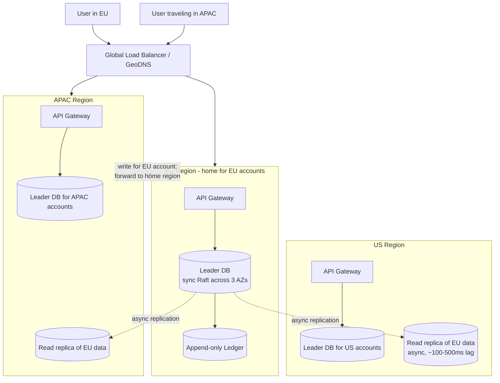
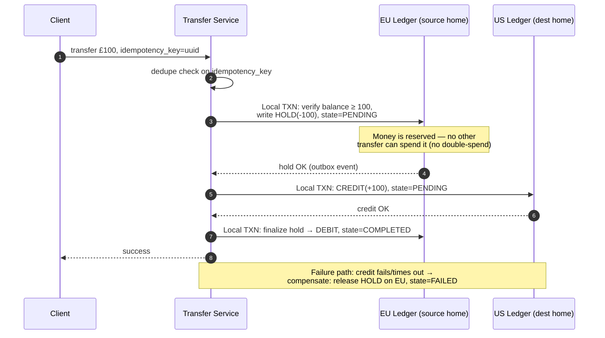
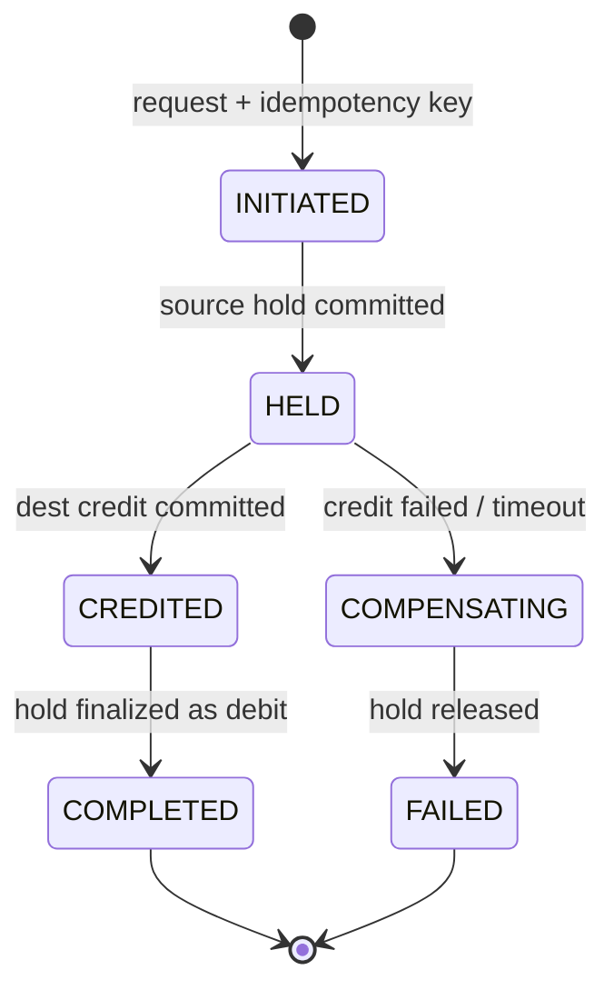
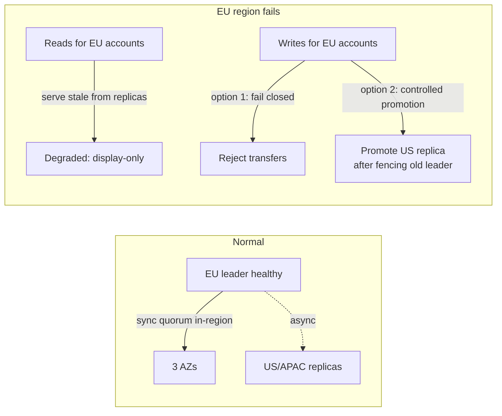

# System Design: Global Bank — Multi-Region Data Consistency

**Interview length:** 30 min | **Level:** New Grad
**Suggested time split:** Requirements (3 min) → High-level (6 min) → Deep dive: transfers (10 min) → Failures (5 min) → Ops (3 min) → Trade-offs (3 min)

---

## 1. Requirements & the key insight (say this first)

Functional: login anywhere, balance checks, transfers, card payments.
Non-functional: low-latency global reads, no double-spend, survive region failure/partition.

**Key insight (state it in the first 2 minutes):**
> "Not all data needs the same consistency. I'll split operations into two classes: money movement must be strongly consistent (CP), everything else can be eventually consistent (AP)."

| Data / Operation | Consistency | Why |
|---|---|---|
| Account balance (authoritative, for debits) | **Strong** | Double-spend prevention |
| Transfers, card authorizations | **Strong** (serialized per account) | Correctness of money |
| Balance display in the app | Eventual (read local replica, show "as of") | Users tolerate seconds of staleness |
| Profile, preferences, statements | Eventual | No correctness risk |
| Login / sessions | Eventual + token-based | JWTs validate locally |

This split is the whole design. CAP theorem: during a partition you can't have both — so choose **CP for writes to money**, **AP for reads**.

---

## 2. High-level architecture: home-region ownership

**Core idea: every account has exactly one *home region* (single-writer).** All writes to an account go through its home region. This eliminates write conflicts by design — you never need to "merge" two versions of a balance.

Why this is natural for a bank: regulators often *require* it (EU data residency / GDPR), and users are geographically sticky — 99% of operations hit the home region anyway.

Request routing rules:

- **Read (balance display):** serve from nearest region's replica → low latency worldwide. Tag with "as of" timestamp.
- **Write (debit/transfer/auth):** route to the account's **home region leader**. A traveling user pays ~150ms cross-region latency on writes only — acceptable for money.
- A small, strongly-consistent **account directory** (account → home region) is cached everywhere.

## 3. Replication strategy (justify each choice)

Two layers, different guarantees:

**Within a region — synchronous, consensus-based (Raft/Paxos across 3 AZs).**
A write commits only after a quorum of AZs has it. Gives zero data loss (RPO=0) for AZ failure and automatic leader failover. This is the "leader-based" part.

**Across regions — asynchronous, log-shipping to read replicas.**
Replicas serve stale-tolerant reads. Async because synchronous cross-region replication would put 100–300ms on *every* write's critical path.

**Why NOT multi-leader / active-active for balances?** If EU and US could both accept a debit on the same account during a partition, both see "balance = 100", both approve a 100 debit → double-spend. Last-writer-wins or CRDTs cannot merge money: a balance is not a mergeable value, it's an invariant (`balance ≥ 0`) that requires serialized writes. Single-writer-per-account avoids the conflict instead of resolving it.

**Data model: append-only double-entry ledger, not a mutable balance column.**
Every movement is two immutable entries (debit one account, credit another). Balance = fold over entries (with periodic snapshots for speed). This gives auditability, easy replication (log shipping), and reconciliation invariants for free (Σdebits = Σcredits, always).

---

## 4. Deep dive: cross-region transfer (no double-spend)

EU account → US account. Two different home regions, so no single DB transaction covers both. Two options — recommend the **saga**, mention 2PC as the alternative:

- **2PC:** atomic but blocking — if the coordinator dies mid-protocol, rows stay locked across regions. Poor availability under partition. Banks avoid it across regions.
- **Saga with a hold/reserve step (recommended):** each step is a local ACID transaction; failures are undone by a compensating transaction. This mirrors how real banking works (pending transactions, holds).

**Why no double-spend:** the hold is taken in a single local ACID transaction on the source's home region, where all writes to that account are serialized. The invariant `balance − holds ≥ debit amount` is checked under that serialization. The cross-region part only moves *already-reserved* money.

Transfer state machine (persist it — this is what recovery replays):

### Idempotency & conflict handling

- **Idempotency key:** client generates a UUID per transfer; every service persists `(key → result)` and returns the stored result on retry. Retries and duplicate clicks become safe.
- **Exactly-once effect = at-least-once delivery + idempotent handlers + transactional outbox.** Events are written to an outbox table in the *same* local transaction as the ledger entry, then published — no "wrote to DB but message lost" gap.
- **Conflicts:** largely designed away (single writer per account). Where concurrent writes exist within a region, use optimistic concurrency (version number / compare-and-swap on account version). For non-money data (profile), last-writer-wins with timestamps is fine.

---

## 5. Regional failure & partitions

- **AZ failure:** in-region Raft elects a new leader in seconds. No data loss. Users don't notice.
- **Region failure — reads:** other regions keep serving balance *displays* from replicas (stale, flagged). Availability preserved for the 95% read path.
- **Region failure — writes:** this is the CP choice. Options, in order of preference:
  1. **Fail closed** for transfers from accounts homed in the dead region (correctness > availability for money).
  2. **Controlled failover:** promote a cross-region replica. Because cross-region replication is async, RPO > 0 — a human-approved runbook decision, and reconciliation cleans up the tail.
  3. **Stand-in processing** for card payments (real-world practice): approve small transactions against the stale replica within a risk limit (e.g., ≤ £200/day), reconcile later. Bounded, priced-in risk — a great point to volunteer.
- **Split-brain protection:** old leader must be **fenced** (lease/epoch numbers — writes carry an epoch, replicas reject stale-epoch writes) before a new one is promoted. Never two writers for the same account.
- **In-flight sagas:** state machine is persisted, so a recovery worker resumes or compensates PENDING transfers when the region returns. Timeouts + compensation mean nothing hangs forever.

---

## 6. Operational concerns

- **Reconciliation:** continuous + end-of-day jobs verify ledger invariants: Σdebits = Σcredits globally, every COMPLETED transfer has matching entries in both regions, no HELD state older than X minutes. Mismatches → alert + break queue for ops. This is the safety net under the saga.
- **Auditing:** the append-only ledger *is* the audit log — nothing is ever updated or deleted; corrections are new compensating entries. Hash-chain entries (each entry includes the previous hash) for tamper evidence. Retain per regulation (e.g., 7 years).
- **Recovery:** RPO=0 in-region (sync quorum); RPO = replication lag for cross-region failover — state this trade-off explicitly. Regular failover drills; point-in-time restore from ledger snapshots + log replay.
- **Observability:** dashboards + alerts on: cross-region replication lag (drives staleness and failover RPO), saga state-machine metrics (count/age of PENDING and COMPENSATING transfers), idempotency-cache hit rate (spike = client retry storm), reconciliation mismatch count (should be ~0), per-region p99 write latency.

---

## 7. Trade-offs summary (close with this)

| Decision | Gain | Cost |
|---|---|---|
| Home-region single-writer | No write conflicts, no double-spend, residency compliance | Cross-region write latency for travelers |
| Sync in-region / async cross-region | RPO=0 locally, fast writes | RPO>0 on regional failover |
| Saga over 2PC | Non-blocking, partition-tolerant | Eventual (seconds) settlement; needs compensation + reconciliation |
| Local stale reads | Global low-latency reads | Displayed balance may lag seconds |
| Append-only ledger | Audit, recovery, reconciliation for free | Balance reads need snapshot/fold machinery |

**Alternative worth naming:** Google Spanner-style global synchronous consensus (TrueTime) gives external consistency across regions but puts cross-continent round-trips on every write — great mention that shows breadth; home-region + saga is the pragmatic industry pattern.

---

## Likely follow-up questions (with one-line answers)

1. *"User pays with a card while flying — home region unreachable?"* → Stand-in processing: approve below a risk threshold against stale replica, reconcile later; decline above it.
2. *"Two simultaneous transfers race for the same balance?"* → Both hit home-region leader; holds are serialized in local ACID transactions; second sees `balance − holds` insufficient.
3. *"Network duplicates the credit message?"* → Destination checks idempotency key inside its local transaction; second application is a no-op returning the stored result.
4. *"Why not CRDTs?"* → CRDTs merge concurrent updates, but `balance ≥ 0` is a global invariant, not a mergeable value — merging two valid debits can produce an invalid state.
5. *"How do users read their own writes if reads are eventual?"* → Session stickiness to home region after a write, or read-your-writes via session token carrying last-write LSN; replica serves only if caught up past it.
